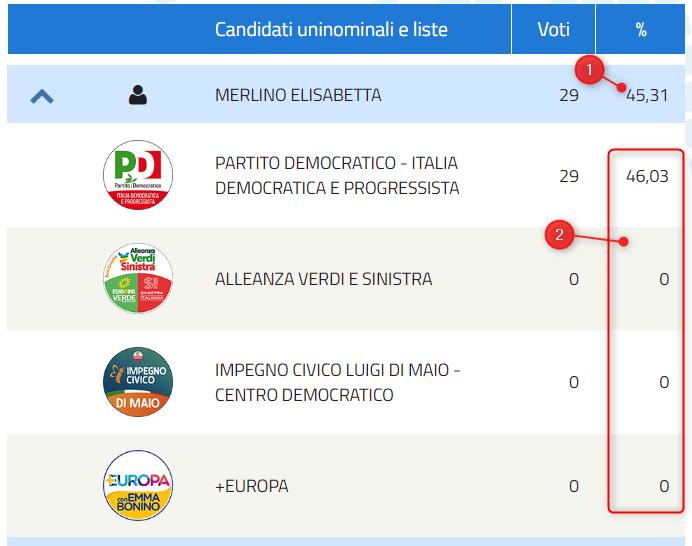

# 2022-10-04

Abbiamo fatto un errore di trasformazione dei dati, legato al campo `perc`, del file [`camera-italia-comune.csv`](dati/risultati/camera-italia-comune.csv). 
Nel file JSON di input di Eligendo infatti ci sono due campi, entrambi con nome `perc` (vedi immagine sotto):

1. è la percentuale dei voti dei/delle candidate/i;
2. è la percentuale del partito/movimento, che sostiene quella/o candidata/o.

È stato aggiunto il campo `perc_cand`, ed è stato inserito come ultimo campo. Quindi adesso nel file [`camera-italia-comune.csv`](dati/risultati/camera-italia-comune.csv) sono presenti questi due campi:

- `perc_cand`, con la percentuale di candidata/o;
- `perc`, con la percentuale della lista.

Grazie [Lorenzo Arcidiaco](https://twitter.com/LArcidiaco) per la segnalazione.

# 2022-09-28

- Abbiamo pubblicato i dati, con il taglio geografico di dettaglio maggiore (Comune o eventuale circoscrizione contenuta) sui risultati della Camera dei deputati (manca ancora la Val D'Aosta). Vedi [qui](https://github.com/ondata/elezioni-politiche-2022/blob/main/affluenza-risultati/README.md#risultati);
- abbiamo aggiunto il codice Istat al file [`camera-italia-comune_anagrafica`](dati/risultati/camera-italia-comune_anagrafica);

# 2022-09-27 9:00

- aggiunto file con dati di affluenza per sesso: le colonne `votif_h23` e `votim_h23` nel file [`affluenzaComuni_mf.csv`](dati/affluenza/affluenzaComuni_mf.csv)
- aggiunte colonne numero elettori maschi e femmine, `ele_m` e `ele_f`, al file [`affluenzaComuni_mf.csv`](dati/affluenza/affluenzaComuni_mf.csv)

# 2022-09-25 13:20

- aggiunti dati di affluenza, alla tornata precedente (le colonne `%h12_prec` `%h19_prec` e `%h23_prec`)
