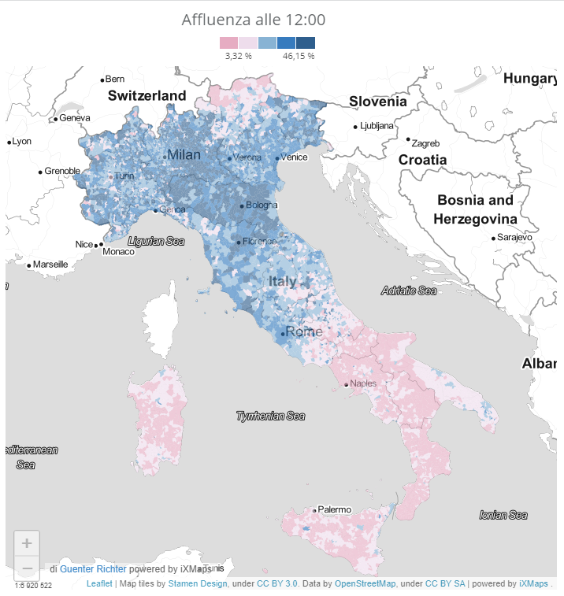
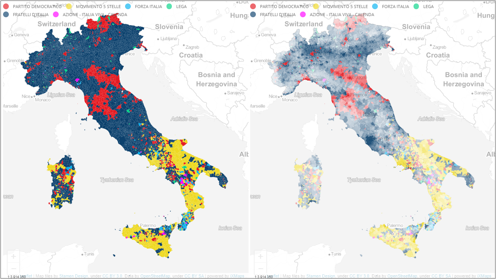

  

# Introduzione

In questa sezione raccoglieremo i dati elettorali estratti da [Eligendo](https://elezioni.interno.gov.it/camera/votanti/20220925/votantiCI), il sito del Ministero dell'Interno, dedicato alle elezioni.

In [questo file di LOG](LOG.md), le note con eventuali modifiche che verranno fatte.

⚠ **️NOTA BENE**: non possiamo garantire a priori di riuscirci, perché le modalità di accesso a questi dati non sono documentate, e potrebbero essere modificate o disabilitate in queste ore.

# Se vuoi usare questi dati

Se vuoi farlo, per favore aggiungi la nota (con il *link*) "da un progetto di [onData](https://github.com/ondata/elezioni-politiche-2022)".

Se vuoi [**sostenerci**](https://ondata.it/dona/), qui le modalità per farlo.

Grazie

# Dati

## Affluenza

I dati per Comune, sono pubblicati in questi file:

- [`affluenzaComuni.csv`](dati/affluenza/affluenzaComuni.csv);
- [`affluenzaComuni_mf.csv`](dati/affluenza/affluenzaComuni_mf.csv), con i dati distinti per sesso (maschi e femmine).

Non raccogliamo, al momento, i voti dall'estero.

## Risultati

Al momento abbiamo scaricato i dati di livello gerarchico più basso (comunale e/o per le grandi città i collegi in esse contenuti), relativi alla Camera dei Deputati.

Questi i file:

- [`camera-italia-comune_anagrafica`](dati/risultati/camera-italia-comune_anagrafica.csv), con i dati di anagrafica, per ogni comune/collegio;
- [`camera-italia-comune.csv`](dati/risultati/camera-italia-comune.csv), con i dati per candidate e candidati e liste relative;
- [`camera_geopolitico_italia.csv`](risorse/camera_geopolitico_italia.csv), la suddivisione "geopolitica" per la Camera.

Alcune note:

- non abbiamo fatto ancora alcun controllo di errore;
- manca al momento la Val D'Aosta;
- manca una descrizione dei campi, ma la gran parte sono deducibili a schermo (speriamo di rimediare presto);
- sono da attenzionare i campi `codice`, nei file `camera-italia-comune_anagrafica` e `camera-italia-comune.csv` e il campo `cod` di `camera_geopolitico_italia.csv`. A seguire un esempio di dettaglio.

Il comune di `CASELLE TORINESE` ha il `cod` `010101101130810620`, che è così composto:

- `01` la regione;
- `01` la circoscrizione;
- `011` il codice del collegio plurinominale;
- `0113`, il codice del collegio uninominale;
- `081`, è il codice provincia;
- `0620`, è il codice comune;

Nel campo `codice`, che qui è `0113-081-0620`, sono riportati soltanto gli ultimi tre blocchi.

## Dati ufficiali Eligendo

Nella [sezione **Reportistica**](https://elezioni.interno.gov.it/report/20220925) di Eligendo, sono stati pubblicati gli scrutini di Camera e Senato.

Ne abbiamo creato una copia, facendo queste operazioni:

- convertendo l'encoding da `iso8859-1` a `UTF-8`;
- cambiando il separatore di campo da `;` a `,`;
- aggiungendo il campo `CODICE ISTAT`, con il codice comunale Istat.

Due i file:

- [`Politiche2022_Scrutini_Camera_Italia.csv`](dati/Eligendo/processing/Politiche2022_Scrutini_Camera_Italia.csv);
- [`Politiche2022_Scrutini_Senato_Italia.csv`](dati/Eligendo/processing/Politiche2022_Scrutini_Senato_Italia.csv).

