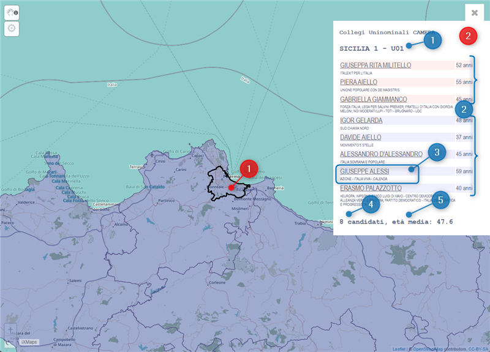

## Le 🗺️ mappe per sapere per chi puoi votare?

Abbiamo creato le **mappe** che al _**click**_ sui poligoni dei collegi elettorali, restituiscono l'**elenco di candidate e candidati di quel collegio**.

Queste **le 4 mappe disponibili** (⚠️ solo da *desktop*, non da mobile):

- **Collegi uninominali**
  - [🗺️ Camera dei Deputati](https://gjrichter.github.io/ixmaps/ui/dispatch.htm?ui=view&basemap=ll&legend=1&project=https://raw.githubusercontent.com/gjrichter/viz/master/Elezioni/Politiche/2022/ixmaps_project_CAMERA_CollegiUNINOMINALI_2020_candidati_poligoni_coalizioni.json)
  - [🗺️ Senato della Repubblica](https://gjrichter.github.io/ixmaps/ui/dispatch.htm?ui=view&basemap=ll&legend=1&project=https://raw.githubusercontent.com/gjrichter/viz/master/Elezioni/Politiche/2022/ixmaps_project_SENATO_CollegiUNINOMINALI_2020_candidati_poligoni_coalizioni.json)
- **Collegi plurinominali**
  - [🗺️ Camera dei Deputati](https://gjrichter.github.io/ixmaps/ui/dispatch.htm?ui=view&basemap=ll&legend=1&project=https://raw.githubusercontent.com/gjrichter/viz/master/Elezioni/Politiche/2022/ixmaps_project_CAMERA_CollegiPLURINOMINALI_2020_candidati_poligoni.json)
  - [🗺️ Senato della Repubblica](https://gjrichter.github.io/ixmaps/ui/dispatch.htm?ui=view&basemap=ll&legend=1&project=https://raw.githubusercontent.com/gjrichter/viz/master/Elezioni/Politiche/2022/ixmaps_project_SENATO_CollegiPLURINOMINALI_2020_candidati_poligoni.json)

Un volta aperta una delle mappe potrai (vedi immagine a seguire):

1. fare *click* sul colleggio di tuo interesse;
2. avere restituito le informazioni su quel collegio.

E poi nella nuvola informativa:

1. Il **nome** del **collegio**
2. l'**elenco** di **candidate** e **candidati**, con la **distinzione** cromatica per **sesso**;
3. il **nome** di candidata/o - su cui potrai fare click per fare una ricerca su quel nome - e i **relativi partiti** (movimenti o gruppi politici);
4. il **numero totale** di candidate e candidati;
5. l'**età media** di di candidate e candidati.

### Con quali dati sono state costruite

Quelli che abbiamo estratto dal sito del **Ministero dell'Interno**, insieme [le basi geografiche dei collegi elettorali](https://www.istat.it/it/archivio/273443) pubblicate da **Istat**.

### Credits

Queste mappe sono state costruite dal "nostro" [Guenter Richter](https://twitter.com/grichter), con il suo iXMaps.

### Se vuoi usare queste mappe

Se vuoi inserirle in una tua pubblicazione, se vuoi *linkarle* o *embeddarle*, per favore aggiungi la nota (con il *link*) "un progetto di [onData](https://github.com/ondata/elezioni-politiche-2022)". Grazie
