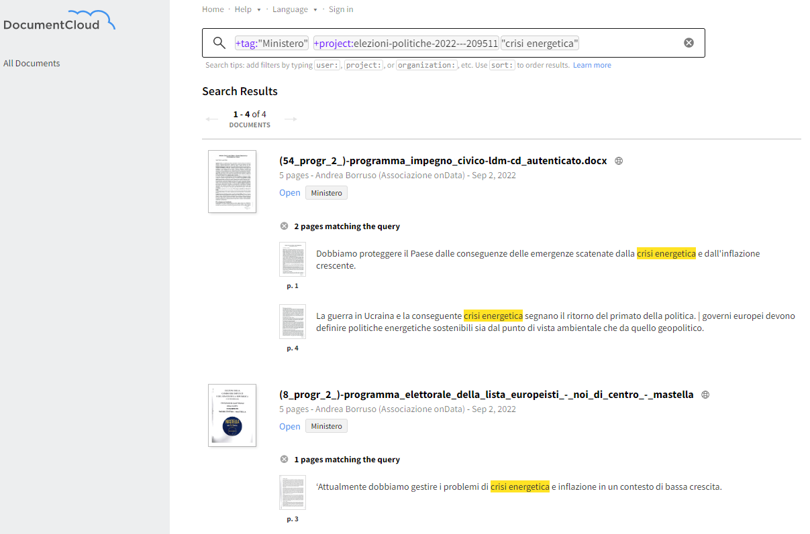

  

- [Programmi elezioni politiche 2022](#programmi-elezioni-politiche-2022)
  - [Introduzione](#introduzione)
  - [Cosa abbiamo fatto](#cosa-abbiamo-fatto)
    - [Anagrafica dei documenti 🖋️](#anagrafica-dei-documenti-️)
    - [Motore di ricerca dei programmi 🔍](#motore-di-ricerca-dei-programmi-)
      - [I programmi consegnati al Ministero](#i-programmi-consegnati-al-ministero)
      - [I programmi presenti sui siti dei partiti](#i-programmi-presenti-sui-siti-dei-partiti)
  - [Note sull'anagrafica dei programmi](#note-sullanagrafica-dei-programmi)
  - [Considerazioni](#considerazioni)

# Programmi elezioni politiche 2022

## Introduzione

Il 25 settembre 2022 si svolgeranno le elezioni politiche 2022.

Così come previsto nelle "[Istruzioni per la presentazione e l'ammissione delle candidature](https://dait.interno.gov.it/documenti/pubb_01_politiche_ed.2022.pdf)", è previsto il  "**deposito, presso il Ministero dell'interno, del programma elettorale del partito o gruppo politico**", anche in formato digitale:

> Per il programma elettorale è richiesto, oltre al formato cartaceo, anche quello digitale, in quanto necessario ai fini degli adempimenti previsti dall'articolo 4, comma 1, della legge n. 165 / 2017 e dall'articolo 2 della legge n. 4 / 2004. Pertanto, dovrà essere consegnato anche un CD-ROM contenente i files **in formato accessibile (PDF/A)**.

L'[articolo 4](https://www.normattiva.it/uri-res/N2Ls?urn:nir:stato:legge:2017-11-03;165~art4) della legge n. 165 / 2017 ha disposto che, in un'apposita sezione del sito internet del Ministero dell'interno, denominata «[ELEZIONI TRASPARENTI](https://dait.interno.gov.it/elezioni/trasparenza/elezioni-politiche-2022)», entro dieci giorni dalla scadenza del termine per il deposito dei contrassegni, per ciascun partito, movimento e gruppo politico organizzato che ha presentato le liste, **SONO PUBBLICATI,IN MANIERA FACILMENTE ACCESSIBILI** (il tutto maiuscolo è presente nelle istruzioni del Ministero):

- il **contrassegno** depositato;
- lo **statuto** ovvero la dichiarazione di trasparenza;
- il **programma** elettorale con il nome e cognome della persona indicata come capo della forza politica.

 Il suddetto sito internet del Ministero dell'interno nasce per **consentire alle persone di accedere agevolmente alle informazioni e ai documenti pubblicati**, "*attraverso la ricerca per cognome e nome di ciascun candidato ammesso, per denominazione del partito, del movimento politico o della lista nonché per circoscrizione in occasione delle elezioni europee ed anche per collegio in caso di elezioni politiche*".

## Cosa abbiamo fatto

### Anagrafica dei documenti 🖋️

L'anagrafica dei documenti presentati dai partiti (movimenti o gruppi politici), oltre a essere visibile nel [sito dedicato](https://dait.interno.gov.it/elezioni/trasparenza/elezioni-politiche-2022), è disponibile anche in formato leggibile meccanicamente (`JSON`) presso questo indirizzo: 
<https://dait.interno.gov.it/documenti/trasparenza/POLITICHE_20220925/POLITICHE_20220925.json>

Avere una fonte unica è molto comodo, ad esempio, per tutte le persone che vogliono leggere e analizzare i vari programmi, per chi vuole creare degli spazi e dei servizi informativi su questa tornata elettorale.

Noi - per il momento - abbiamo voluto scaricare tutti i programmi disponibili, per leggerne alcune delle caratteristiche intrinseche (il rispetto dell'accessibilità, il formato, il numero di pagine, ecc.).

### Motore di ricerca dei programmi 🔍

#### I programmi consegnati al Ministero

È possibile fare ricerche testuali sui file dei programmi caricati sul sito del Ministero dell'Interno, a partire da questa pagina
<https://www.documentcloud.org/app?q=%2Btag%3A%22Ministero%22%20%20%2Bproject%3Aelezioni-politiche-2022---209511>.

Basterà aggiungere del testo al campo di ricerca presente. Ad esempio:

- [`"crisi energetica"`](https://www.documentcloud.org/app?q=%2Btag%3A%22Ministero%22%20%20%2Bproject%3Aelezioni-politiche-2022---209511%20%22crisi%20energetica%22) (come nell'immagine di sotto), troverà tutti i documenti in cui le due parole sono entrambe presenti, una dopo l'altra. È importante in questo caso l'uso delle virgolette `"` in cui racchiudere le due parole;
- [`scuola AND inclusione`](https://www.documentcloud.org/app?q=%2Btag%3A%22Ministero%22%20%20%2Bproject%3Aelezioni-politiche-2022---209511%20scuola%20AND%20inclusione), per tutti i programmi in cui sono presenti sia la parola `scuola`, che `inclusione`. Qui c'è da fare attenzione al maiuscolo di `AND`;
- [`"scuola inclusione"~10`](https://www.documentcloud.org/app?q=%2Btag%3A%22Ministero%22%20%20%2Bproject%3Aelezioni-politiche-2022---209511%20%22scuola%20inclusione%22~10), per avere tutti i documenti in cui la parola `scuola` e la parola `inclusione` non distano tra loro più di 10 parole. È il carattere `~` seguito da `10`, dopo le due parole tra `"`, che imposta la distanza in parole.

Si possono fare diversi altri tipi di ricerca, con altri parametri. Qui la [📖documentazione](https://www.documentcloud.org/help/search).

È possibile anche utilizzare le API di DocumentCloud ([❓guida](https://www.documentcloud.org/help/api)), per avere restituito l'esito delle ricerche in formato `JSON`. 
Per `"crisi energetica"` tramite API l'URL da chiamare sarà [questo](https://api.www.documentcloud.org/api/documents/search/?format=json&hl=true&q=%2Btag%3A%22Ministero%22%20%20%2Bproject%3Aelezioni-politiche-2022---209511%20%22crisi%20energetica%22), composto da:

- `https://api.www.documentcloud.org/api/documents/search/`, l'URL base;
- `?format=json`, per impostare il formato di output;
- `&hl=true`, per avere restituito la parte del testo dove appare la stringa cercata;
- `&q=%2Btag%3A%22Ministero%22%20%20%2Bproject%3Aelezioni-politiche-2022---209511%20%22crisi%20energetica%22`, che è la vera e propria *query*, con la codifica delle stringhe `+tag:"Ministero"  +project:elezioni-politiche-2022---209511 "crisi energetica"`.

---

⚠️**NOTA BENE**: alcune ricerche di testo sui PDF del sito del Ministero non funzionano in modo ottimale, perché spesso erano composti da sole immagini e non da testo. È stato applicato l'`OCR`, per abilitare la ricerca testuale, che non sempre ha prodotto risultati ottimali.

---

#### I programmi presenti sui siti dei partiti

È possibile anche fare ricerche sulle versioni dei programmi che i partiti (movimenti o gruppi politici) hanno reso disponibili sui loro spazi di comunicazione. Spesso queste versioni dei programmi sono diverse da quelle disponibili sul sito del ministero.

➡️ La pagina di partenza è [questa](https://www.documentcloud.org/app?q=%2Btag%3A%22No%20Ministero%22%20%20%2Bproject%3Aelezioni-politiche-2022---209511%20), con il tag **`No Ministero`**.

Una delle fonti dei programmi non ministeriali è [indecis.it](https://github.com/indecis-it/data).

## Note sull'anagrafica dei programmi

- **35** i **partiti** (movimenti o gruppi politici) in elenco;
- **31** i **programmi** disponibili. Al 2 settembre 2022 non è presente un programma per:
  - MOVIMENTO ASSOCIATIVO ITALIANI ALL'ESTERO - MAIE
  - MOVIMENTO DELLE LIBERTA'
  - UNIONE SUDAMERICANA EMIGRATI ITALIANI - USEI
  - LEGA PER SALVINI PREMIER - FORZA ITALIA - FRATELLI D'ITALIA
- i **formati file** dei programmi sono così suddivisi:
  - **30** file **PDF**;
  - **1** file **DOC** (non è un formato file citato nel documento di istruzioni);
- Circa il **75% dei programmi in PDF** - 23 su 30 - **non ha il testo leggibile** (contengono soltanto immagini);
- **6 programmi** sono composti da **meno di 3 pagine**. Il 75% rientra in un massimale di 18 pagine;
- due partiti, "PARTITO DEMOCRATICO - ITALIA DEMOCRATICA E PROGRESSISTA" e "ALLEANZA VERDI E SINISTRA", sono presenti in elenco (sia su [sito](https://dait.interno.gov.it/elezioni/trasparenza/elezioni-politiche-2022), che sul [file JSON](https://dait.interno.gov.it/documenti/trasparenza/POLITICHE_20220925/POLITICHE_20220925.json) che fa da fonte) più di una volta: il primo ha depositato una versione differente del contrassegno per la sezione Estero (dicitura con le iniziali maiuscole e il resto delle parole minuscole invece che tutta in maiuscolo), il secondo ha depositato varianti con dicitura in lingua tedesca, slovena, e ladina.

Qui il [file di anagrafica](processing/anagrafica.csv) informativa sui programmi (i dettagli al momento sono presenti soltanto su quelli in formato PDF).

## Considerazioni

È un bruttissimo segnale che il **75% dei programmi** consegnati da partiti, movimenti o gruppi politici al Ministero dell'Interno non abbiano **il testo leggibile**. 
Sia dal lato di chi consegna, sia dal lato di chi riceve, che dovrebbe pretendere dei documenti senza alcuna barriera, garantendo l'**accessibilità**, nel rispetto dei [diritti di cittadinanza digitali](https://ondata.github.io/guida-diritti-cittadinanza-digitali/parte-seconda/accessibilita/).

**Alcuni** dei **programmi** pubblicati sul sito del Ministero, **sono già vecchi** e **abbondantemente superati**. Un esempio per tutti quello del partito "LEGA PER SALVINI PREMIER": il file [sul sito del Ministero](https://dait.interno.gov.it/documenti/trasparenza/POLITICHE_20220925/Documenti/9/(9_progr_2_)-lega_per_salvini_premier.programma.pdf) è composto da **circa 15 pagine**, quello pubblicato [sul sito del partito](https://static.legaonline.it/files/Programma_Lega_2022.pdf) da **circa 200**.
Sicuramente questa difformità non è "fuori legge", ma il Ministero dovrebbe richiedere di ricevere nel tempo anche gli aggiornamenti dei documenti, archiviandone le varie versioni. Altrimenti è una trasparenza (per i programmi) non efficace e troppo formale.

Richiedere l'invio dei programmi, consentirebbe al Ministero di creare non soltanto un unico punto d'accesso con l'elenco di tutti programmi, ma uno spazio ad esempio dove **abilitare la ricerca testuale di parole chiave in tutti i testi presentati** (un motore di ricerca dei programmi politici), o la possibilità di condividere porzioni di testo correlate alla fonte ministeriale (un embedding alla YouTube, ma di testo).
